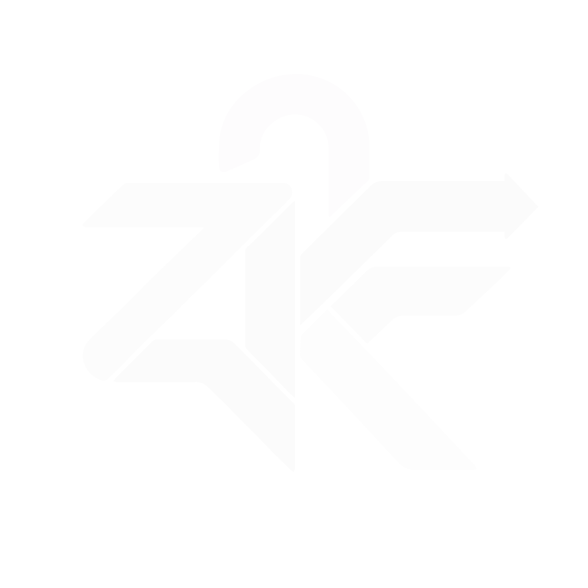
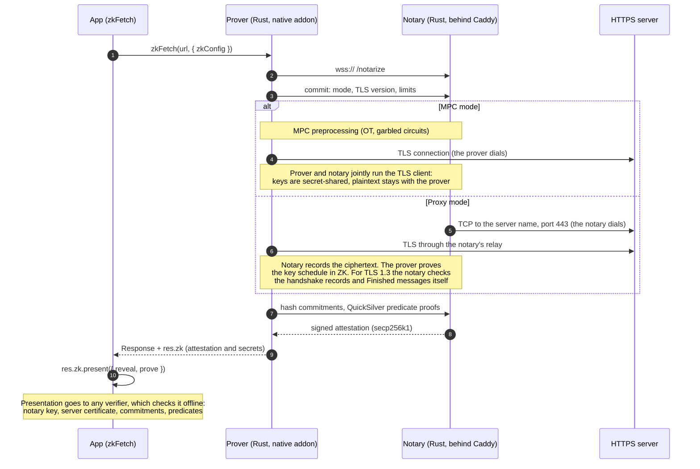

<p align="center">
  
</p>

<h1 align="center">zkfetch</h1>

<p align="center"><code>fetch</code> with a proof.</p>

zkfetch makes an HTTPS request together with a notary and returns a normal
`Response` plus a signed attestation. Afterwards the user chooses what to
reveal (URL, headers, JSON fields) or proves facts about hidden values, such as
`longestStreak >= 365`. The result is a presentation anyone can verify offline.
The notary never sees private data such as auth tokens, and the user cannot
forge what the server sent.

It is built on [TLSNotary](https://github.com/tlsnotary/tlsn) (pinned
`v0.1.0-alpha.15`, vendored and patched), with a Rust core, a Bun/Node SDK and
a notary that runs on a small ARM server (AWS Graviton, Mumbai).

## On top of TLSNotary

| Addition | What it does |
| --- | --- |
| **TLS 1.3 (MPC)** | MPC-TLS over TLS 1.3 (AES-128-GCM, P-256): an HKDF key schedule in MPC, public handshake keys, private application keys, authenticated record suffixes. |
| **Proxy mode, TLS 1.2 and 1.3** | The notary relays the connection and the prover proves the session keys in zero knowledge. Kilobytes of traffic instead of ~66 MB of MPC preprocessing. For TLS 1.3 the notary decrypts and checks the handshake it relayed. |
| **QuickSilver predicates** | Numeric (`gte`, `gt`) and JSON-shape proofs over hidden plaintext, checked by the notary during the session and signed into the attestation. The default backend. |
| **Binius64 predicates** | Opt-in. Per-leaf BLAKE3 commitments let the user prove new predicates later, offline, without the notary. |
| **JSON selective disclosure** | Reveal by dotted path (`users.0.username`), including array elements. With the default QuickSilver backend the notary attests the shape of every JSON value, so `verify()` returns each disclosed value with a proven path (`result.json`). Disclosing a field therefore also reveals the response's keys and punctuation, not its other values. |
| **Commit only what you disclose** | `zkConfig.reveal` declares the `present()` spec at fetch time, and the prover commits one BLAKE3 commitment per disclosed unit (header, JSON field, target, body, skeleton) instead of one per header and JSON node. Hidden values are not committed at all. Those commitments were 54% of the ZK work (1.62 M of 3.0 M AND gates per session). Measured (M2 Max, local fixture): proxy prove 135 → 59 ms (−56%), session 210 → 130 ms (−38%); MPC prove 154 → 50 ms (−67%); presentation 22.8 → 6.7 KB (−71%). Live Duolingo, proxy: prove 127 → 50 ms (−60%). Later presentations can disclose that spec or less, never more; Binius sessions still prove new predicates later. No notary or verifier change. |
| **Session binding** | `zkf.owner` / `zkf.context` attestation extensions for wallet binding and verifier challenges. |
| **`fetch`-shaped SDK** | `zkFetch(url, init)` returns a standard `Response`. Sessions serialize, so the reveal can be decided later. |
| **Automatic version and backend** | `tlsVersion: "auto"` selects TLS 1.3; attempts are never automatically retried. Select TLS 1.2 explicitly for compatibility. One `backend` switch configures commitments and proofs. |
| **Single-threaded MPC** | A patched executor runs MPC without OS threads, for wasm hosts such as Workers. |
| **Multi-threaded wasm** | A threaded browser build spreads OT work across Web Workers in cross-origin isolated contexts. |
| **Prepared sessions** | `prepare()` runs the notary connection and preprocessing before the request, so a click only waits for TLS, proofs and attestation. |
| **Persistent VOLE setup** | Proxy sessions retain unused Ferret correlations in memory across calls, skipping base OT, OT extension and the first Ferret tree round on the next session. The pool handshake includes the notary key challenge, and setup messages are pipelined. Measured with a local TLS 1.3 fixture at simulated 33 ms RTT (10 runs each): setup 513 → 138 ms (−73%), end-to-end notarization 963 → 585 ms (−39%), total traffic 2.21 → 1.32 MiB (−40%). Correlations use single-use, transcript-bound leases scoped to the device and capability token; consumed state is zeroized and missing pools fall back to fresh OT. Pools last for the process or wasm instance. FLOW3 hosted and browser checks are reported below. [Measurement report](docs/session-setup-2026-10-09.md). |
| **D4 three-exchange session flow** | Warm TLS 1.3 proxy sessions send ClientHello, configuration and the first Ferret round in the signed opening; the Ferret check overlaps TLS. The proof and attestation request leave in one bounded flight, with the attestation as its reply. Relay traces confirm three exchanges after WebSocket opening (latency slope estimates ~3.5 RTTs). Completing D4 with the same ORIGO schedule cuts local warm medians from 338 → 245 ms at 33 ms RTT and 860 → 538 ms at 100 ms RTT. Cold OT bootstrap and prepared setup remain ahead of this online flow; circuits beyond the declared VOLE budget fail safely. [Measurements and completion criteria](docs/d4-d2-2026-10-09.md). |
| **D2 ORIGO key schedule** | TLS 1.3 proxy FLOW3 proves both application keys and IVs with 16 SHA-256 compressions instead of 32 (−50%). Application keys and downstream outer HMAC states stay private. This is a separate circuit reduction; end-to-end D4 measurements include it. The relation adds ORIGO’s compression-function assumptions; RFC 8448 vectors, a direct legacy-VM differential and mutation coverage for every revealed intermediate class pass; independent review remains outstanding. Select `zkConfig.protocolV2: false` for the full schedule and legacy flow. [Security boundary](docs/d4-d2-security.md). |
| **V2 offline presentations** | Ciphertext and application-key commitments support later numeric top-level JSON claims. Compact AES, prefix decryption, cached public circuit templates, parallel checks and versioned profile bindings reduce work. Real Chrome fixture medians: Fast 350 ms / 66.6 KiB; Small 490 ms / 46.9 KiB; signed-head Fast 112 ms / 27.4 KiB. Signed headers move work into notarization; the ≤100 ms target remains unmet. Nested Duolingo streak claims currently require v1. Independent review and latest hosted deployment/testing remain outstanding. [Implementation, measurements and security limits](docs/v2-presentation-optimizations.md). |
| **Notary hardening** | The notary signs the session mode and, in proxy mode, the host it dialed (verifiers reject a different server name); dials only public addresses; caps relayed bytes, predicate work, sessions per client (429) and total sessions (503); and closes connections that do not start a session within 15 s. |
| **Hosted notary** | The native notary on a `t4g.small` in `ap-south-1` behind Caddy (HTTPS), with scripts that create and delete it ([`infra/aws`](infra/aws)). |

The protocol patches are listed in
[`vendor/tlsn/ZKFETCH_PATCHES.md`](vendor/tlsn/ZKFETCH_PATCHES.md) and
[`vendor/mpz/ZKFETCH_PATCHES.md`](vendor/mpz/ZKFETCH_PATCHES.md). The TLS 1.3
and proxy-mode patches have not had a security review yet.

## Performance

All optimizations keep every byte on the wire identical, so old and new
provers and notaries interoperate.

| Change | Where | Measured |
| --- | --- | --- |
| ARM64 PMULL carry-less multiplication, runtime-detected | native ARM64 | proxy session −47% (M2 Max) |
| Eight-row Ferret LPN encoder with local accumulators | all | encoder −41–44%, proxy session −5% |
| QuickSilver check with lazy GF(2^128) reduction (from emp-toolkit) | all | proxy session −2.8% |
| wasm SIMD128 | browsers | prover CPU −40% (with the two above) |
| Multi-threaded wasm, 8 threads | isolated browser workers | prover CPU 3.3 s → 1.1 s |
| `prepare()` ahead of the request | browsers | wait after click 6–9 s → 2.3–3 s (live, proxy) |
| `zkConfig.reveal`: commit only the declared disclosure | all | proxy prove 135 → 59 ms, session 210 → 130 ms; MPC prove 154 → 50 ms (M2 Max, fixture, predicate only); presentation 22.8 → 6.7 KB |
| Notary in Mumbai instead of Cloudflare (reached from India via Hong Kong/Singapore) | hosting | native Duolingo proof, proxy: 15–17 s → 2.1 s (live, from India) |

Live latency is dominated by about 21 sequential prover-notary round trips.
Measurements and methods:
[profiling](docs/quicksilver-hotspots-2026-10-08.md),
[first PMULL report](docs/quicksilver-profile-2026-10-08.md).

## Request lifecycle



Binius is excluded from default builds. Legacy `zkf/1` Binius presentations
require the Rust `legacy-binius` feature on the prover/verifier (or napi/wasm
binding). Existing v1 QuickSilver and v2 VOLEitH paths remain available.

## SDK

```sh
npm install @omnid/zkfetch
```

```ts
import { zkFetch, verify } from "@omnid/zkfetch";

const res = await zkFetch("https://api.example.com/me", {
  headers: { Authorization: `Bearer ${token}` }, // never revealed
  zkConfig: {
    notaryUrl: "wss://15-207-105-149.sslip.io/notarize", // infra/aws/deployment.json
    expectedNotaryKey: NOTARY_PUBLIC_KEY, // pin from your trusted deployment
    mode: "mpc",           // or "proxy": much less traffic, trusts the notary-to-server path
    tlsVersion: "auto",    // "1.3" | "1.2" | "auto"
    backend: "quicksilver",// or "binius" for offline predicates later
    predicates: [{ jsonPath: "streak.length", predicate: { gte: "365" } }],
    context: challenge,    // verifier nonce bound into the attestation
  },
});

await res.json();          // a normal Response

// Reveal one field, prove the hidden streak is at least 365 days.
const presentation = res.zk.present({
  response: { jsonPaths: ["username"] },
  prove: [{ jsonPath: "streak.length", predicate: { gte: "365" } }],
});

// Anyone, offline.
const result = verify(presentation, {
  trustedNotaryKeys: [NOTARY_PUBLIC_KEY],
  expectedContext: challenge,
});
console.log(result.serverName, result.json); // [{ path: "username", value: "…" }]
```

| API | Purpose |
| --- | --- |
| `zkFetch(url, init)` | A notarized `fetch`. Returns `Response & { zk: ZkSession }`. |
| `res.zk.present(spec)` | Builds a presentation that discloses only what `spec` selects and proves `spec.prove`. |
| `res.zk.timings` | Per-phase latency: connect, setup, TLS, proving, attestation. `prewarmed` marks connect and setup done ahead; `voleResumed` marks a warm Ferret pool. |
| `prepare(url, zkConfig)` | Runs the notary connection and MPC preprocessing (most of the latency) before the request. Pass the result as `zkConfig.prepared`. Single use, expires after 80 s, falls back to a fresh session. wasm builds; a no-op on the native prover. |
| `zkConfig.reveal` | The `present()` spec, if known at fetch time. Commits only to what it discloses, so proving is about half as expensive and hidden values are not committed at all. Later presentations can disclose that spec or less (whole headers, fields, target or body), never more. Binius sessions can still prove new predicates later. |
| `res.zk.toJSON()` / `restoreResponse(data)` | Save a session and present it later. The JSON holds secrets; treat it like a credential. |
| `verify(presentation, opts)` | Offline verification against pinned notary keys (required; `allowUntrustedNotary` only to inspect), the expected context and the required predicates. Returns the notary-signed `mode`; a proxy proof must name the server the notary dialed, and `rejectProxy` accepts only MPC-TLS. `recvAuthed`/`sentAuthed` give the authenticated byte ranges: decide from those, since a hidden byte and a literal `X` look the same in `recv`. |
| `startNotary()` / `startFixture()` | A local notary and HTTPS fixture for development and tests. |

## Runtimes

`import { zkFetch } from "@omnid/zkfetch"` resolves to the right prover through
conditional exports:

| Runtime | Prover | Notes |
| --- | --- | --- |
| Node.js ≥ 22 / Bun (servers) | Native Rust addon | Multi-threaded and fastest. Both modes. Prebuilt for macOS arm64 for now; other platforms fall back to the wasm prover automatically (`runtime` reports which). |
| Browsers, web workers | wasm (`browser` condition) | SIMD, single-threaded by default; no `SharedArrayBuffer` or cross-origin isolation needed. Run it in a worker to keep the page responsive. Call `await init()` before `present()`/`verify()`. |
| Cross-origin isolated workers | multi-threaded wasm | `init(wasm, { threads: { module: url-of("@omnid/zkfetch/wasm-threads/zkf.js") } })` from a Web Worker. Falls back to one thread without isolation. About 3× less prover CPU with 8 threads. |
| Chrome extensions (MV3) | wasm, in a page worker or the service worker | Needs `"wasm-unsafe-eval"` in the extension CSP; `init(chrome.runtime.getURL("zkf_bg.wasm"))`. Threads need `cross_origin_embedder_policy`/`cross_origin_opener_policy` in the manifest and a worker started from an extension page. See [`packages/chrome-extension`](packages/chrome-extension). |

To hide setup latency, prepare while the user is still deciding, then fetch:

```ts
const zkConfig = { notaryUrl: NOTARY_URL, expectedNotaryKey: NOTARY_PUBLIC_KEY, mode: "proxy" } as const;
const prepared = prepare("https://api.example.com/me", zkConfig); // e.g. when a dialog opens
// ...later, on click:
const res = await zkFetch("https://api.example.com/me", { headers, zkConfig: { ...zkConfig, prepared } });
```

Proxy mode now reuses a single-use Ferret bootstrap pool automatically across
successful calls in the same native process or wasm instance. The notary caches
up to 16 pools, scoped to the admitted capability and device ticket; the client
keeps up to four, scoped to endpoint, key pin and TLS version. Idle entries expire
after ten minutes and are purged on cache access. A restart, eviction, cancelled
session, failed proof or stale ticket uses fresh OT. Correlations stay in memory
and are never serialized to disk, localStorage or a presentation.

Set `zkConfig.persistentVole: false` for a fresh-OT baseline. Pool negotiation
shares the key-possession challenge exchange, and setup pipelines configuration
with Ferret initialization. An authenticated legacy notary triggers a fresh
connection using the original setup flow. `prepare()` also uses the pool.

For sub-step counters and a reproducible 33 ms RTT comparison:

```sh
RUST_LOG=zkfetch::setup=info cargo run --release -p zkf-prover --example profile_quicksilver -- --reveal --rtt-ms 33 --runs 10 --out /tmp/pool.json
# Add --fresh-ot for the baseline; omit --rtt-ms for local compute.
```

The counters distinguish base OT, OT extension, Ferret bootstrap and tree
rounds, and key authentication. See [the setup measurements](docs/session-setup-2026-10-09.md)
for measured savings and remaining costs.

Browsers cannot open TCP sockets. Proxy mode works everywhere because the
notary dials the server. MPC mode in a browser needs `zkConfig.relayUrl`, a
WebSocket-to-TCP relay. React Native gets its own package later.

## Quickstart

Requires Bun and Rust 1.98.1 (selected by `rust-toolchain.toml`).

```sh
bun install
bun run build            # release binaries + native addon
bun run test             # Bun + Rust end-to-end tests
bun run playground       # Duolingo longest-streak demo (see .env.example)

infra/aws/up.sh          # hosted notary on EC2 (infra/aws/down.sh deletes it)
```

Browser builds need wasm-pack; the threaded build also needs a nightly
toolchain with `rust-src` (`ZKF_NIGHTLY` picks one, default `nightly`):

```sh
bun run --cwd packages/wasm build           # SIMD, single-threaded
bun run --cwd packages/wasm build:threads   # multi-threaded (optional)
bun run --cwd packages/chrome-extension build   # Duolingo side-panel extension
bun packages/sdk/scripts/build-npm.ts       # the @omnid/zkfetch package
```

The [Chrome extension](packages/chrome-extension) proves a Duolingo username
and longest streak in proxy mode, with threads and a prepared session.

Application authorization, replay challenges, JSON disclosure privacy and notary
key rotation are documented in [the security policy](docs/security-policy.md).
